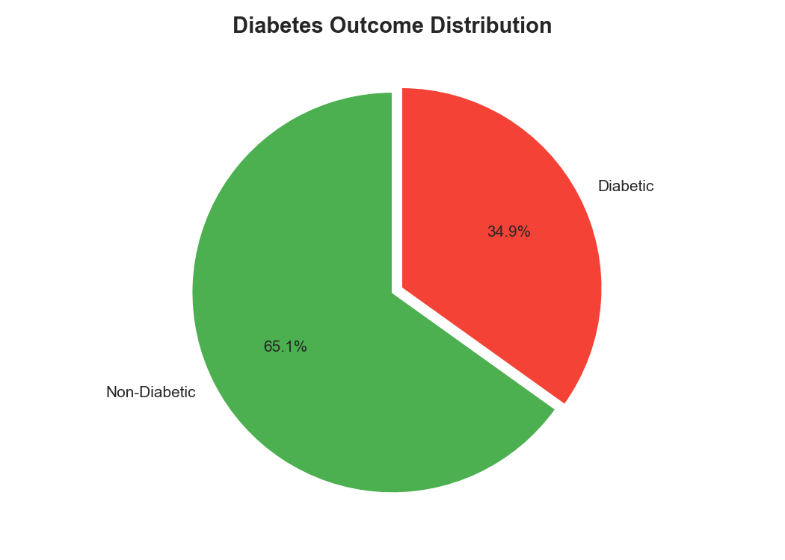
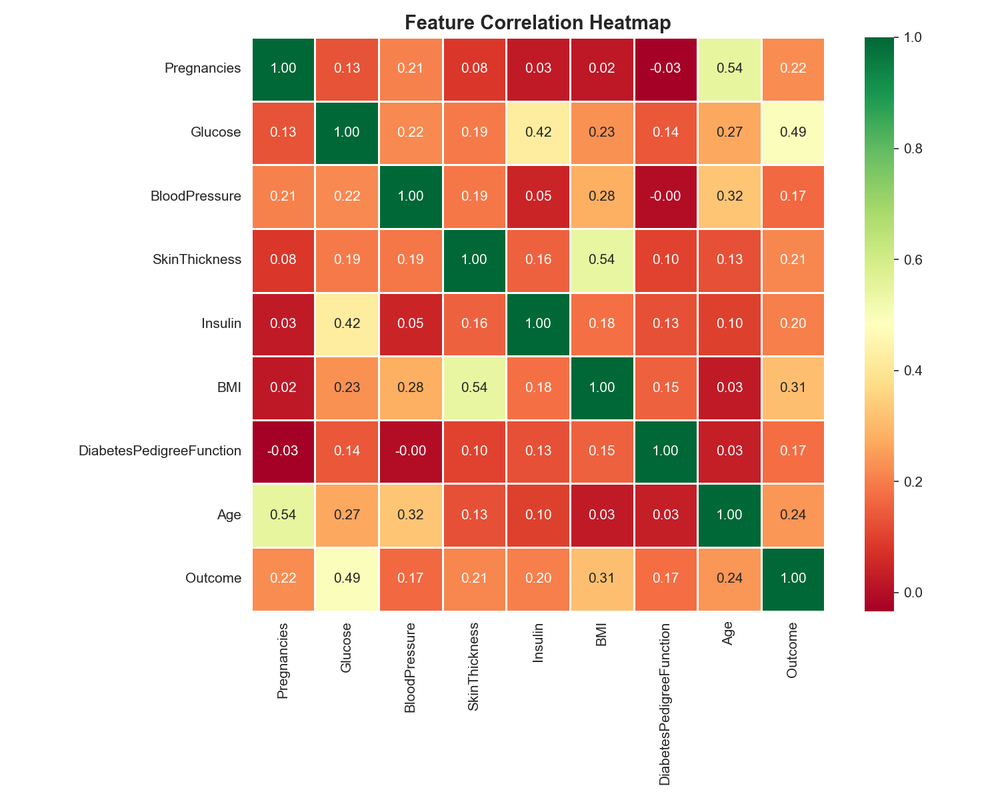
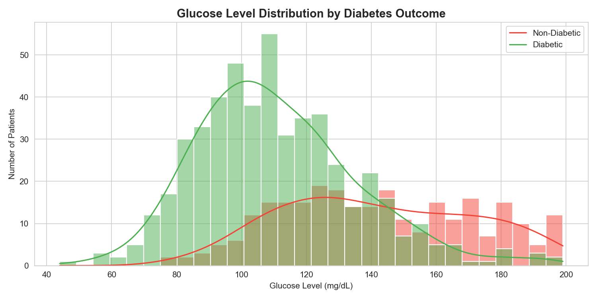
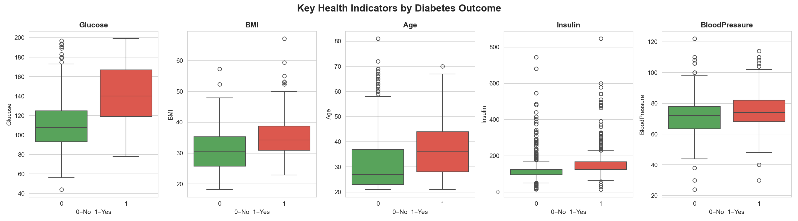

# 🏥 Healthcare Diabetes Analysis

## Problem Statement
Identify key health indicators that influence diabetes 
risk by comparing diabetic vs non-diabetic patients 
using the Pima Indians Diabetes Dataset.

## Dataset
- **Source:** Pima Indians Diabetes Database (Kaggle)
- **Rows:** 768 patients
- **Columns:** 9 health indicators
- **Target:** Outcome (0 = Non-Diabetic, 1 = Diabetic)

## Tools Used
Python | Pandas | NumPy | Matplotlib | Seaborn | Jupyter Notebook

## Key Findings
- Glucose is the strongest predictor of diabetes (0.49 correlation)
- Diabetic patients have 28% higher glucose levels (142 vs 110 mg/dL)
- Diabetic patients have higher average BMI (35.4 vs 30.9)
- Diabetes risk increases with age (37 vs 31 years average)
- 48.7% of Insulin values were hidden zeros — cleaned using median imputation

## Visualizations

## Dataset Source
[Pima Indians Diabetes Dataset — Kaggle](https://www.kaggle.com/datasets/uciml/pima-indians-diabetes-database)
