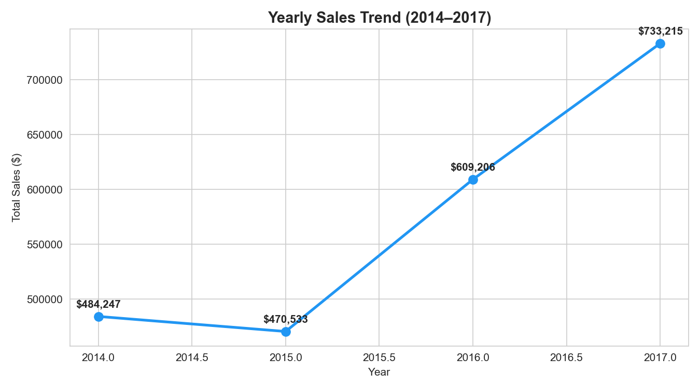
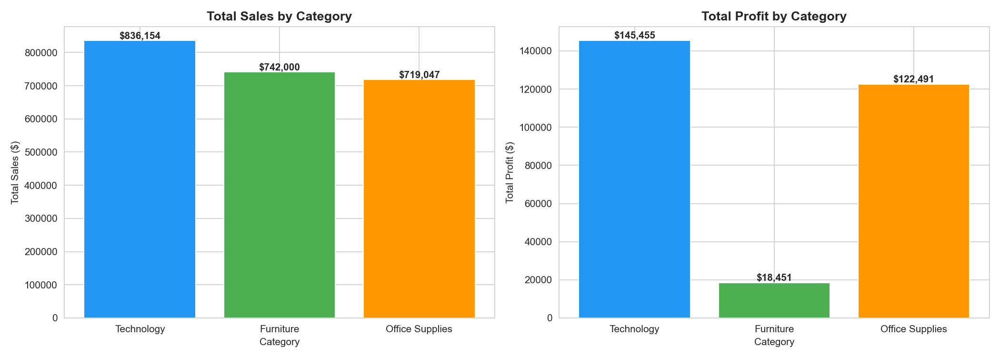
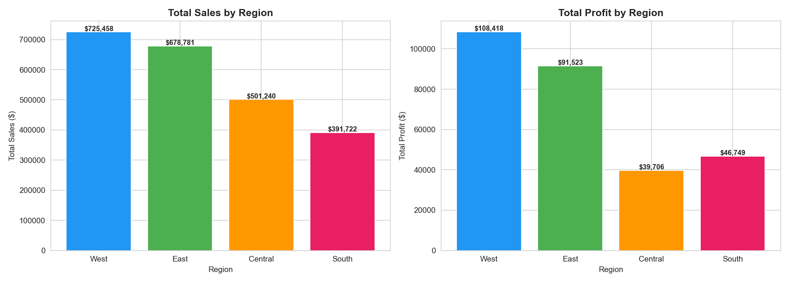
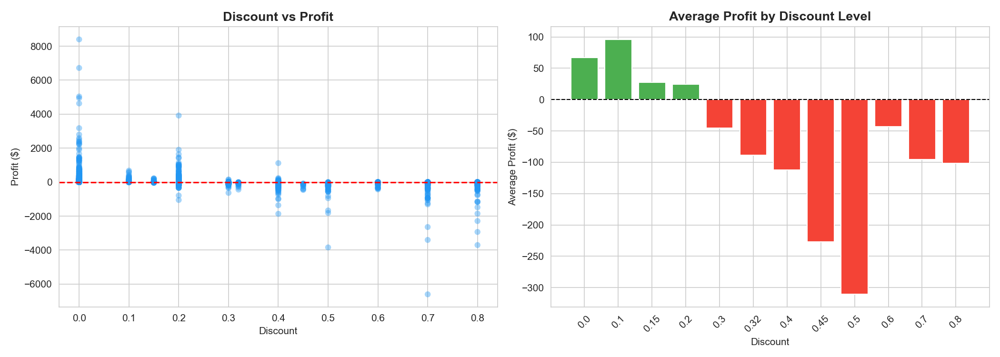

# 🛒 Superstore Sales Analysis

## Problem Statement
Analyze 4 years of retail sales data to identify revenue trends,
top-performing products, customer segments, and regional performance.
Uncover factors causing profit loss and provide actionable recommendations.

## Dataset
- **Source:** Sample Superstore Dataset (Kaggle)
- **Rows:** 9,994 orders
- **Period:** 2014 – 2017
- **Columns:** 21 features including Sales, Profit, Discount, Region, Category

## Tools Used
Python | Pandas | Matplotlib | Seaborn | MySQL | Power BI | Jupyter Notebook

## Workflow
1. Data Loading & Cleaning
2. Exploratory Data Analysis (EDA)
3. SQL Analysis (10 business queries)
4. Power BI Dashboard
5. Key Insights & Recommendations

## Key Findings
- Sales grew 51% from $484K (2014) to $733K (2017)
- Technology = highest profit ($145K), Furniture = critically low profit ($18K)
- Tables and Bookcases sub-categories are loss-making
- 922 orders with 50%+ discount generated -$97K total loss
- West region leads in both sales and profit
- Consumer segment drives 50%+ of total revenue
- November and December are peak sales months (Q4 seasonality)

## Business Recommendations
1. Review Furniture pricing strategy — high sales but very low profit
2. Reduce discounts above 40% — directly causing losses
3. Invest more in Technology — best profit margin
4. Focus marketing budget on Q4 (Nov-Dec peak)
5. Investigate Central region underperformance

## Visualizations

## SQL Analysis
10 business queries covering:
- Revenue & profit summary
- Category & region performance
- Discount impact analysis
- Top customers & products
- Sub-category profitability

Full queries → `sql_queries/analysis.sql`

## Dataset Source
[Superstore Dataset — Kaggle](https://www.kaggle.com/datasets/vivek468/superstore-dataset-final)